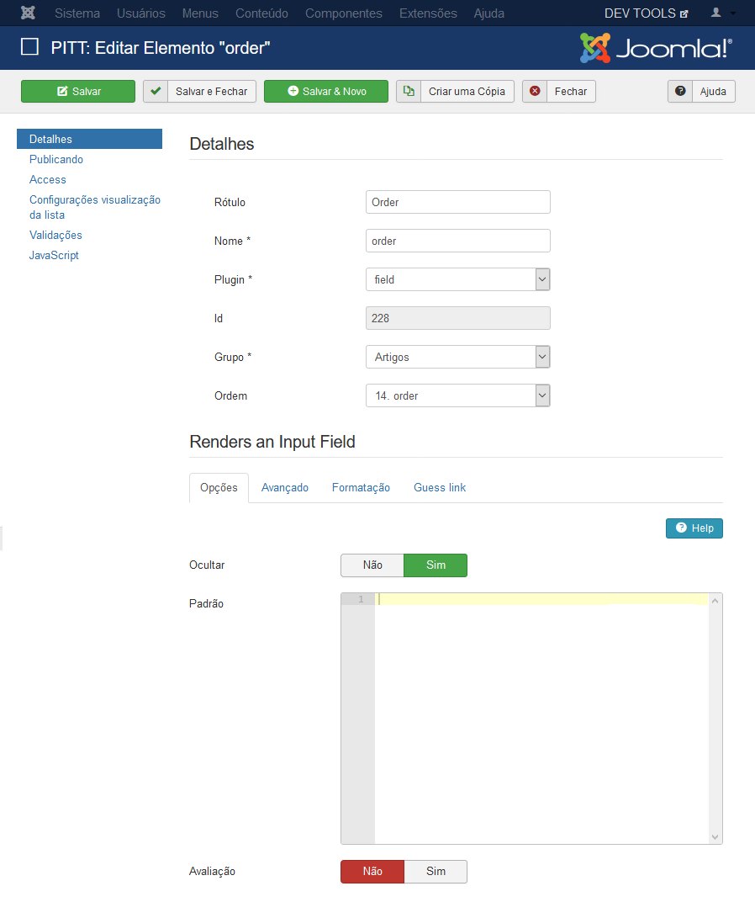
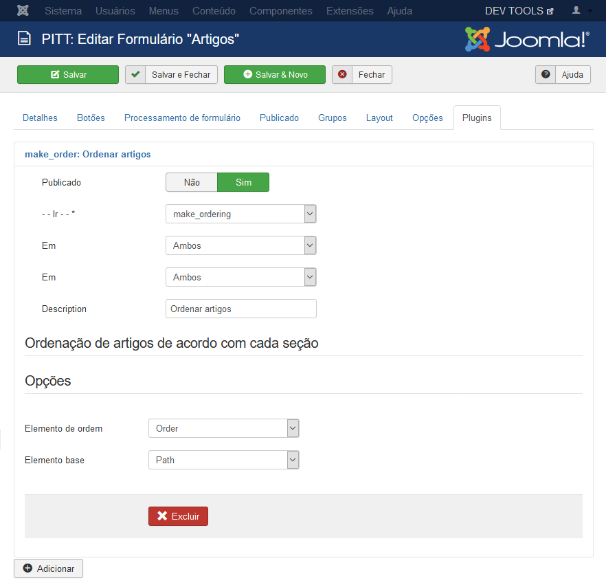

# Make Ordering
Plugin de formulário que faz a ordenação dos artigos por meio da ordem alfabética das seções.

## Utilização
Primeiramente, é necessário a criação de um novo elemento do tipo **Field** na lista de **Artigos** e oculta-lo do formulário, marcando "Sim" na opção **Ocultar**.

Posteriormente, carregue o [plg_fabrik_form_make_ordering.zip](https://github.com/pittufg/make_ordering/releases) na página de administração do joomla e ative-o. Clique para editar o formulário de **Artigos** e entre na aba de **Plugins**. Clique para **Adicionar** e escolha o plugin **make_ordering**. Selecione o elemento de ordem, que é o elemento criado anteriomente e também selecione o elemento que servirá de base para a ordenação, no caso, o elemento **path** que faz referência as seções.

### Observações
A primeira ordenação somente será feita após a criação de um novo registro ou edição de algum registro.
