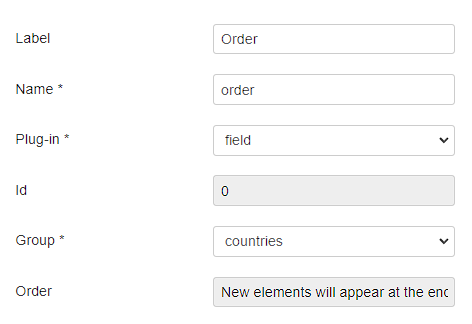
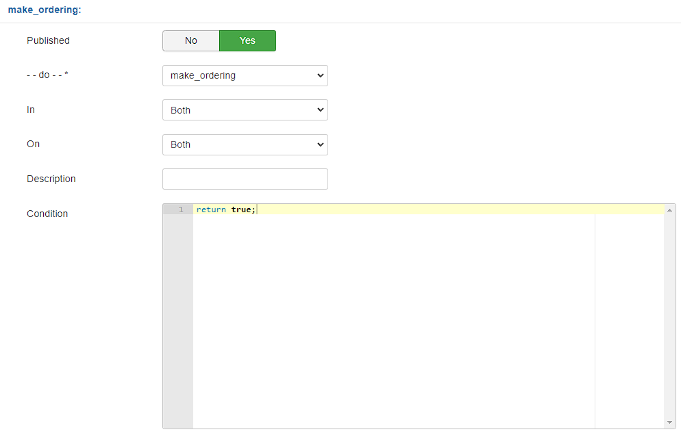
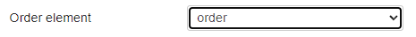
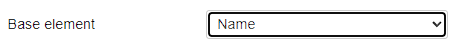

# Make Ordering - Form Plugin

 

  

## Conteúdo

- [Sobre](#sobre)
- [Configuração](#configuração)
  - [Order element](#order-element)
  - [Base element](#base-element)
- [Uso](#configuração)

## 💭 Sobre

O make_ordering é um plugin de formulário que permite a ordenação dos artigos em ordem alfabética por meio das seções.

## ⚙️ Configuração

De início, é necessário adicionar na lista um novo elemmento do tipo field que será responsável por armazenar a ordem atual:

Agora é necessário editar o formulário, acessar a aba de plugins e selecionar o make_ordering como plugin.

Em condition, escreve a condição a qual o plugin será acionado, neste caso será como `return true`:

### Order element

Na opção Order element, selecione a o element recém criado anteriormente que armazenará a ordem:

### Base element

Selecione o element que de fato será utilizado como base para realizar a ordenação

## 💻 Uso

Ao criar um novo registro ou editar um registro existente, o plugin irá realizar a primeira ordenação dos registros.
